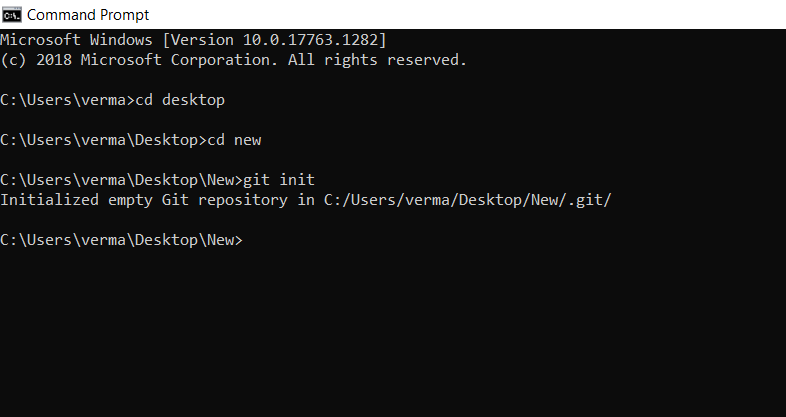
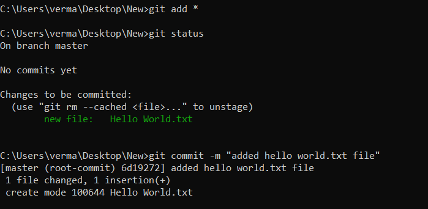
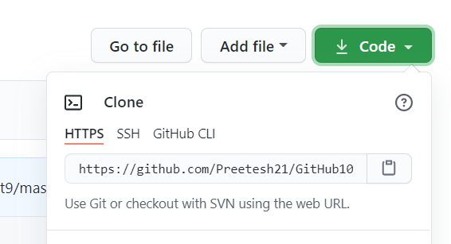

## Connecting Local folder to Github Repository


Suppose you have a local folder on your machine and you want to turn it into a Git Repository and then connect to a Github Remote Repository.Here are the steps.

1) Using your desired terminal, move to your folder and then initialize your local folder as a git repository using the command ```git init```.



2) Do the changes in the folder.Thereafter Add and Commit all the changes you have made with a proper message.



3) Now to connect to the Github we need to first make a new repository over there with the details as required by the user and then link it to our local folder as origin. Github itself provides the link to connect to the remote repository when you create a new repository.


To connect we need to add the remote link using the command ```git remote add origin <remote repo link>```.

Thereafter to to pull any changes from the remote we use ```git pull``` and to push the changes to the remote we use ```git push ``` .


### Congrats!!! You connected your local folder to the github repository.
